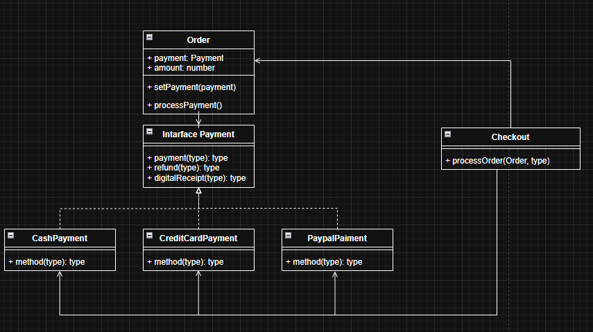
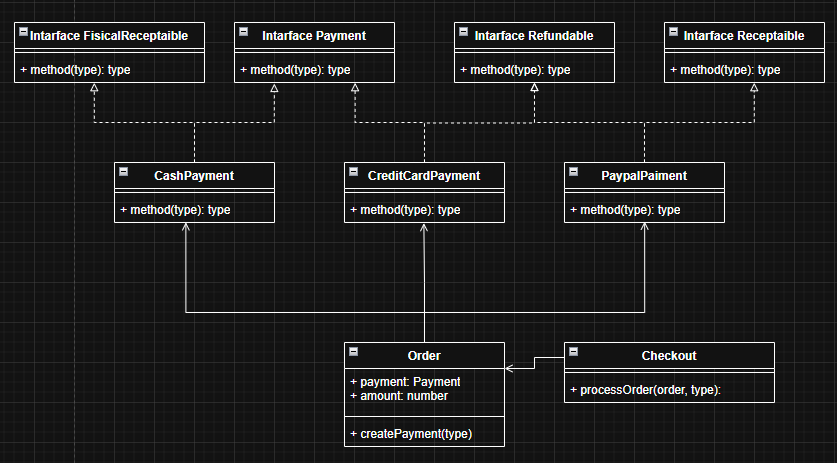

# Principios de Diseño Aplicados – Exposición Práctica

# Equipo 2. Comparación: implementación sin ISP/Creator vs implementación con ISP/Creator

## Objetivo del Taller

Analizar, ejemplificar y aplicar principios de diseño de software en un contexto práctico, evidenciando cómo su correcta aplicación transforma un modelo de clases y su código asociado, mejorando:

* Mantenibilidad
* Extensibilidad
* Cohesión
* Bajo acoplamiento
* Calidad estructural del diseño

Este trabajo se enfoca en demostrar decisiones de diseño fundamentadas mediante la evaluación de beneficios.

## Dominio elegido
El dominio es **e-commerce**, específicamente el flujo de **checkout y procesamiento de pagos** para una orden (`Order`) con métodos como tarjeta, PayPal y efectivo.

## Descripción del problema inicial
En `src/problem` se muestran dos problemas principales:

1. **Sin Creator (GRASP):**
	 - `Checkout` crea directamente los objetos de pago (`CreditCardPayment`, `PayPalPayment`, `CashPayment`).
	 - `Order` recibe el pago desde afuera con `setPayment(...)`, aunque `Order` es quien contiene ese estado y lo usa para procesar/reembolsar/emitir comprobante.
	 - Resultado: alta dependencia de `Checkout` con clases concretas y menor cohesión en `Order`.

2. **Sin ISP (Interface Segregation Principle):**
	 - La interfaz `Payment` obliga a todos los métodos a implementar `payment`, `refund` y `digitalReceipt`.
	 - `CashPayment` implementa comportamientos “vacíos” o no aplicables (por ejemplo, mensajes de que no aplica reembolso/comprobante digital), lo que evidencia una interfaz demasiado grande para algunos clientes.

## Principios aplicados
- **ISP (Interface Segregation Principle):**
	Se separa la interfaz en contratos pequeños y específicos: `Payment`, `Refundable`, `Receiptable` y `FisicalReceiptable`.

- **Creator (GRASP):**
	`Order` asume la creación del método de pago con `createPayment(...)`, porque tiene la información necesaria (`amount`) y es quien posee la relación directa con el pago.

## Justificación breve de decisiones de diseño
- **Mayor mantenibilidad:** cada clase implementa solo lo que necesita; se evita código forzado por una interfaz monolítica.
- **Mejor cohesión:** `Order` concentra el comportamiento de su propio ciclo de pago (crear, pagar, reembolsar, comprobante).
- **Menor acoplamiento en `Checkout`:** `Checkout` deja de conocer detalles de construcción de pagos y delega en `Order`.
- **Evolución más simple:** agregar un nuevo método de pago o nueva capacidad (por ejemplo, comprobante físico) requiere menos cambios transversales y reduce riesgo de romper implementaciones existentes.

## Diagramas de clases

### Problema `src/problem`

### Solución `src/solution`

## Preguntas Críticas Abordadas

* ¿Quién debe crear a quién y por qué?

Bajo el principio GASP debe crear quien Contiene al objeto, controla su ciclo de vida, tiene los datos necesarios para inicializarlo, aplica reglas sobre él.

* ¿Cómo afecta la creación al acoplamiento?
La creación afecta al acoplamiento en la medida que existe una dependencia del constructor y la clase utilizada en cada lugar donde se crea, entonces si la creación esta dispersa, los cambios se propagan y son dificiles de mantener.

* ¿Cuándo una interfaz está “gorda”?

Una implementación esta gorda cuando no todas las clases que lo implementan utilizan todos los metodos.

* ¿Dividir interfaces siempre mejora el diseño?

No siempre, si se utiliza el principio sin criterio podría generar complejidad innecesaria en el codigo y exceso de microinterfases.

* ¿Factories pueden violar ISP?

Si, ya que este es un principio busca que una sola factory cree todo, lo que va en direccion opuesta al principio ISP.

* ¿Qué smells aparecen cuando se ignoran estos principios?

** Creator
Creación dispersa
Logica duplicada
Validaciones inconsistentes

** ISP
Metodos no usados
Implementaciones forzadas
Interfaces con multiples responsabilidades

## Conclusión

La aplicación conjunta de **Creator (GRASP)** e **ISP** demuestra cómo decisiones estructurales bien fundamentadas transforman un diseño frágil en un modelo coherente, extensible y sostenible.

El objetivo no es aplicar principios por dogma, sino comprender cuándo, por qué y a qué costo hacerlo.