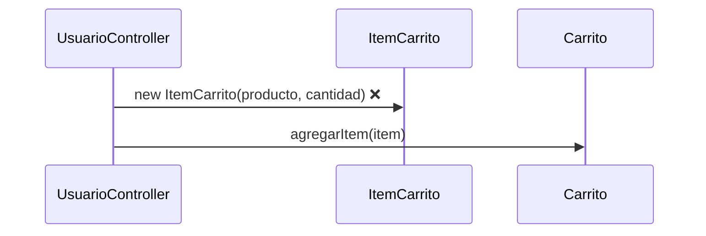
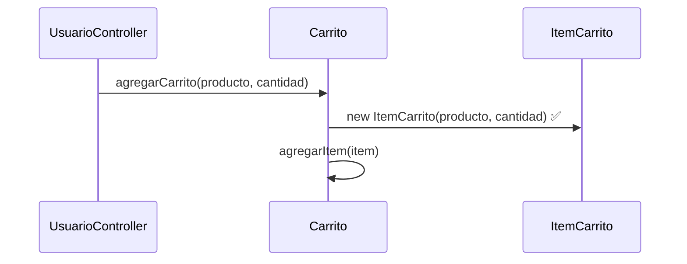

# Creator (GRASP) - Diagramas

Para **Creator**, el diagrama más claro suele ser el de **secuencia**, porque muestra explícitamente **quién crea el objeto**.

## 1) Problema (sin aplicar Creator)

### Diagrama de secuencia

## 2) Solución (aplicando Creator)

### Diagrama de secuencia

## Idea clave para explicarlo fácil

En Creator, la pregunta central es: **¿quién debería crear `ItemCarrito`?**

- Si una clase **contiene** o **administra** esos objetos, normalmente esa clase debe crearlos.
- Aquí, `Carrito` contiene `ItemCarrito`, por eso `Carrito` es el creador natural.
